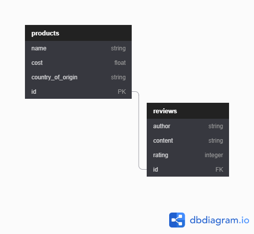

# _Latte Larry’s Online Store_

---

An online store for the fictional coffee shop _Latte Larry’s_, 10/16/2020

By **AJ Markow**

## Description

A “Curb Your Enthusiasm” themed online store for a ‘spite store’.

- Focused on well-validated data, using callbacks to consistently format data in Postgres database.
- Product Database is seeded with 250 products using the Faker gem.

## Setup/Installation Requirements

1. Git clone repository
2. Run bundle install
3. Run rake db:reset
4. Run rails s to start live server.
5. Access project at [http://localhost:3000](http://localhost:3000/)
6. Interact with site to add

## Known Bugs

No known bugs as of most recent commit on 10/16/2020.

## Support and contact details

aj@ajm.codes or contact me at [https://ajm.codes](https://ajm.codes/)

## Technologies Used

Bootstrap, CSS, Embedded Ruby, Git, HTML, Ruby, Rails.

## Database Schema

### License

MIT License

Copyright (c) 2020 **AJ Markow**

Permission is hereby granted, free of charge, to any person obtaining a copy
of this software and associated documentation files the Software, to deal
in the Software without restriction, including without limitation the rights
to use, copy, modify, merge, publish, distribute, sublicense, and/or sell
copies of the Software, and to permit persons to whom the Software is
furnished to do so, subject to the following conditions:

The above copyright notice and this permission notice shall be included in all
copies or substantial portions of the Software.

THE SOFTWARE IS PROVIDED AS IS, WITHOUT WARRANTY OF ANY KIND, EXPRESS OR
IMPLIED, INCLUDING BUT NOT LIMITED TO THE WARRANTIES OF MERCHANTABILITY,
FITNESS FOR A PARTICULAR PURPOSE AND NONINFRINGEMENT. IN NO EVENT SHALL THE
AUTHORS OR COPYRIGHT HOLDERS BE LIABLE FOR ANY CLAIM, DAMAGES OR OTHER
LIABILITY, WHETHER IN AN ACTION OF CONTRACT, TORT OR OTHERWISE, ARISING FROM,
OUT OF OR IN CONNECTION WITH THE SOFTWARE OR THE USE OR OTHER DEALINGS IN THE
SOFTWARE.

Copyright (c) 2020 **_{List of contributors}_**
